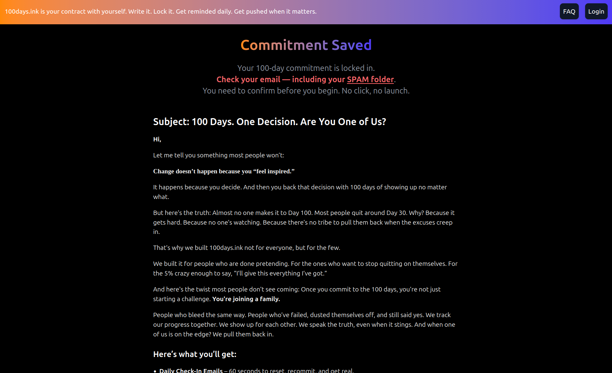
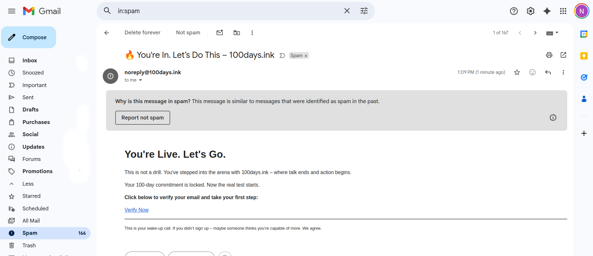
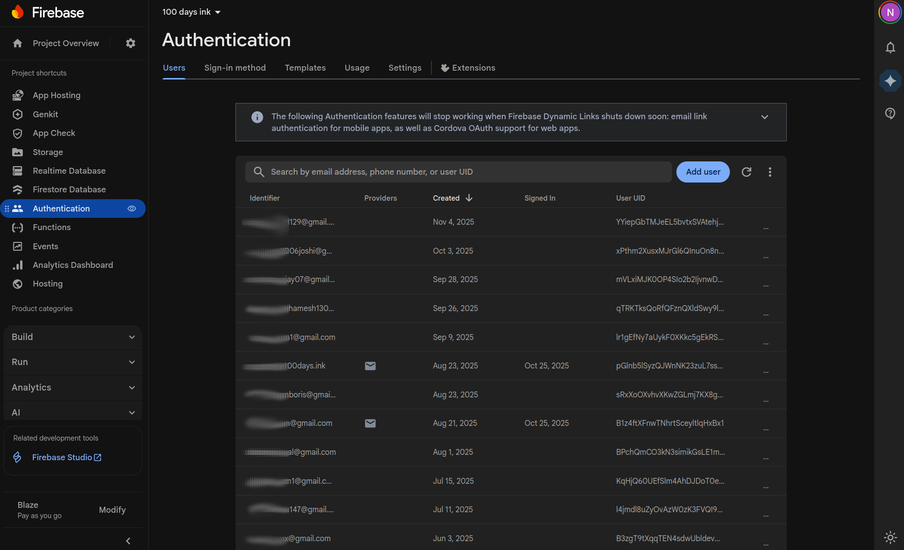
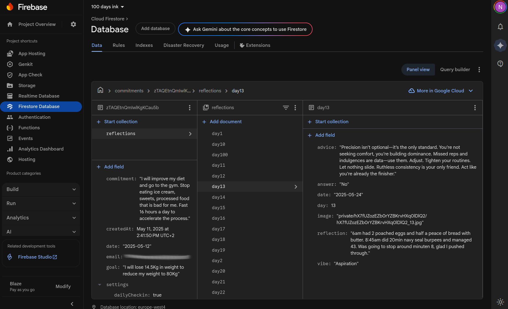
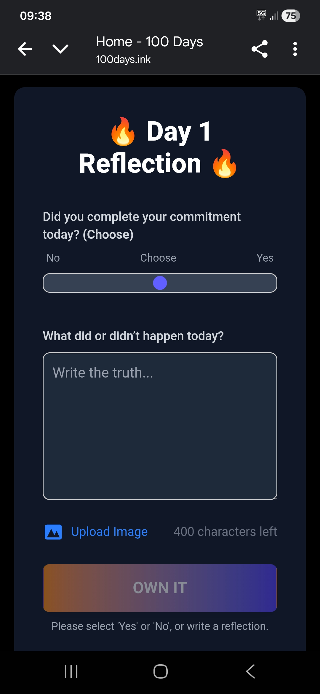
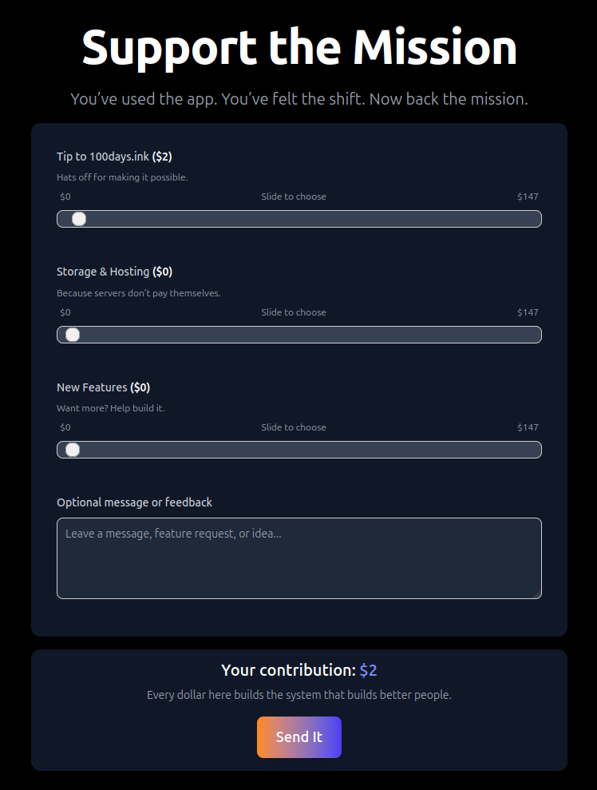

I’ve been building [100days.ink](https://100days.ink), a small app with a big purpose:  
help people commit to something for 100 days and actually follow through.

The rules are simple:

- Write down your 100-day commitment.  
- Pick a start or end date.  
- Decide if it’s private, public, or shared with the community.  
- Support the idea with a tip.  

That’s it. No feeds. No distractions. Just you versus the next 100 days.


The idea comes from watching the video [I Worked Out Like David Goggins for 100 Days](https://youtu.be/vWU5O7cK7aI?si=Qvuerw0Zx3Y68PMf). Both entertaining and showing what happens when you truely commit to goal. Momentum compounds when you consistenly deliver. It lit the spark for my own 100-day project but instead of doing fitness, I wanted to program again and why not build a commitment engine that backs you on such a venture. Something that turns promises into action and accountability into a game you can actually win.

I wanted massive scaling capacity and chose Firebase. Their NoSQL backend provides granual access control and easy auth. I eventually extended with Firebase Storage for images, because words aren’t always enough. On top of that I run a free cron-job.org task to push daily reminders with short coaching notes to your mailbox and a weekly digest newsletter. To make it dynamic, the AI coach changes tone: if you skip check-ins, the temperature parameter gets dialed up, making the responses a little sharper, a little more urgent. The app is minimal on purpose, a fun MVP. 

I didn’t expect login and then email to be the hardest parts of the 100days.ink project. If registration emails land in the spam folder, your app is dead before it starts. 



Even with a notice to look in the spam folder, few persons actually completed the registration.



You get what you pay for. And this one-size-fits-all backend forced me to jam Firebase’s user model into mine. Registration emails come from their *.firebaseapp.com domain. That’s a red flag for spam filters when your sending domain is 100days.ink. 



The Firestore database I found very practical. 



I liked building in Next.js with TypeScript. The API routes, file-based routing, server + client all in one was a good first experience. I’ve worked with Angular before and completed a project in Ember.js, but moving into the React ecosystem was a great. 

Making it mobile friendly was important to me. You get a link every day to reflect on your 100 day mission. 



Every day, the system runs a user’s most recent reflections through OpenAI, combining their goal, coaching style, and behavioral patterns to generate personalized advice and an email subject line in their coach’s voice. It tags each reflection with a “vibe” like grit or desperation, adjusts the tone dynamically based on past engagement, trying to keep users moving forward—even if it has to jolt them.


I was worried OpenAI usage might blow up my budget, so I limited output length and kept prompts tight. But it turns out, even with daily usage across multiple users, the cost has been laughably low.


I pushed 100days on X and ran a small ad campaign, but it didn’t gain much traction. In September I stared building the social features, but ultimately decided to wrap the project.


There were several cool parts of the project:

**Motivational styles of the AI**

* Data-driven coach definitions: [data/architypes.json](https://github.com/neilspink/100days-site/blob/main/data/architypes.json)
* Behavioral constraints: [data/guardrails.json](https://github.com/neilspink/100days-site/blob/main/data/guardrails.json)
* Used by the coaching pipeline: [app/api/coaching/route.ts](https://github.com/neilspink/100days-site/blob/main/app/api/coaching/route.ts)

**AI coaching pipeline**

* [app/api/coaching/route.ts](https://github.com/neilspink/100days-site/blob/main/app/api/coaching/route.ts) (OpenAI Responses API + Firestore reads/writes + cron header guard)
* Job runners: [scripts/runCoaching.js](https://github.com/neilspink/100days-site/blob/main/scripts/runCoaching.js), [scripts/executeCoaching.js](https://github.com/neilspink/100days-site/blob/main/scripts/executeCoaching.js)

**Single-use / time-limited “mission day” links (JWT)**

* Link generator: [lib/generateLink.ts](https://github.com/neilspink/100days-site/blob/main/lib/generateLink.ts)
* API wrapper: [app/api/generate-link/route.ts](https://github.com/neilspink/100days-site/blob/main/app/api/generate-link/route.ts)
* Consumed by daily pushes: [app/api/push-daily/route.ts](https://github.com/neilspink/100days-site/blob/main/app/api/push-daily/route.ts)
* The mission day page: [app/mission/day/[id]/page.tsx](https://github.com/neilspink/100days-site/blob/main/app/mission/day/%5Bid%5D/page.tsx)

**Reflection system with image upload**

* Reflection API: [app/api/reflect/route.ts](https://github.com/neilspink/100days-site/blob/main/app/api/reflect/route.ts) (multipart parsing, uploads, conditional reuse of existing image)
* UI list: [app/components/ReflectionList.tsx](https://github.com/neilspink/100days-site/blob/main/app/components/ReflectionList.tsx)
* Active user + signed image URLs: [lib/mission.ts](https://github.com/neilspink/100days-site/blob/main/lib/mission.ts)

**Automated email engine using Markdown templates**

* Template loader + subject parsing: [lib/email-template.ts](https://github.com/neilspink/100days-site/blob/main/lib/email-template.ts)
* Weekly templates: [lib/emails/](https://github.com/neilspink/100days-site/tree/main/lib/emails)
* Sending flows: [app/api/push-daily/route.ts](https://github.com/neilspink/100days-site/blob/main/app/api/push-daily/route.ts) and [app/api/commitment/route.ts](https://github.com/neilspink/100days-site/blob/main/app/api/commitment/route.ts)

**Daily workflow orchestrator (“push-daily”)**

* Orchestrator: [app/api/push-daily/route.ts](https://github.com/neilspink/100days-site/blob/main/app/api/push-daily/route.ts)

**Monetization path: Stripe “tip” checkout**

* Tip endpoint: [app/api/tip/route.ts](https://github.com/neilspink/100days-site/blob/main/app/api/tip/route.ts)
* Support page: [app/support/page.tsx](https://github.com/neilspink/100days-site/blob/main/app/support/page.tsx)



**Image uploads feature**

I assumed image uploads would be a quick win: accept a photo, store it, show it back in the reflection timeline. On the UX side, I didn’t want “upload failed” to be a dead end. If the upload fails due to size, the user gets a direct link to compress the image and try again (e.g. Squoosh: https://squoosh.app/). 

The core trick in providing this feature was adapting `NextRequest` for multipart parsing + safe failure UX

```ts
import { NextRequest, NextResponse } from "next/server";
import multer from "multer";
import { Readable } from "stream";

const MAX_BYTES = 200 * 1024; // 200 KB
const COMPRESS_LINK = "https://squoosh.app/";

// Multer in-memory upload with hard limits + mime filtering
const upload = multer({
  storage: multer.memoryStorage(),
  limits: { fileSize: MAX_BYTES },
  fileFilter: (_req, file, cb) => {
    if (!file.mimetype.startsWith("image/")) {
      return cb(new Error("Only image uploads are allowed."));
    }
    cb(null, true);
  },
});

// Promise wrapper for classic Node middleware
function runMiddleware(req: any, res: any, fn: any) {
  return new Promise<void>((resolve, reject) => {
    fn(req, res, (result: any) => (result instanceof Error ? reject(result) : resolve()));
  });
}

// Adapt NextRequest -> Node Readable so multer can parse multipart/form-data
function toNodeReadable(req: NextRequest) {
  const nodeReq: any = new Readable({ read() {} });
  nodeReq.headers = Object.fromEntries(req.headers.entries());
  nodeReq.method = req.method;
  nodeReq.url = req.url;
  return nodeReq;
}

function isMulterFileTooLarge(err: unknown) {
  // Multer uses code === "LIMIT_FILE_SIZE" for size issues
  return typeof err === "object" && err !== null && (err as any).code === "LIMIT_FILE_SIZE";
}

export async function POST(req: NextRequest) {
  const nodeReq = toNodeReadable(req);
  const nodeRes = { end() {}, setHeader() {}, getHeader() {} };

  // Push the full body into the Readable stream for multer to consume
  const body = Buffer.from(await req.arrayBuffer());
  nodeReq.push(body);
  nodeReq.push(null);

  try {
    await runMiddleware(nodeReq, nodeRes, upload.single("image"));
  } catch (err) {
    // Defensive programming: clear, actionable error for the user
    if (isMulterFileTooLarge(err)) {
      return NextResponse.json(
        {
          error: `Image is too large (max ${MAX_BYTES / 1024}KB).`,
          help: "Compress your image and try again:",
          link: COMPRESS_LINK,
        },
        { status: 413 }
      );
    }

    return NextResponse.json(
      { error: "Upload failed. Please try a different image." },
      { status: 400 }
    );
  }

  const fields = nodeReq.body ?? {};
  const file = nodeReq.file; // { originalname, mimetype, buffer, size, ... }

  if (!fields.reflection || !fields.answer || !fields.day) {
    return NextResponse.json({ error: "Missing required fields." }, { status: 400 });
  }

  // ...continue with auth checks, validation, storage upload, and DB write...
  return NextResponse.json({ ok: true });
}

