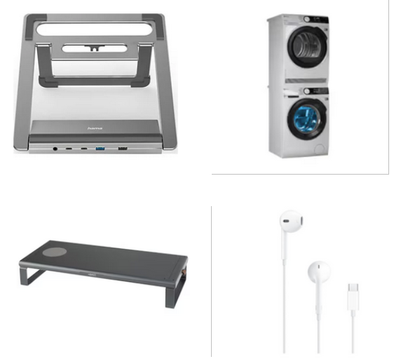

Recently, I went looking for a USB-C monitor. I typed exactly that into the onlineshop of the nearest electronics store getting nothing relevant back. Confused, I ran the same search on four more major Swiss retailers. One showed only cables. Two didn’t list any monitors. One buried the relevant products under five unrelated results. Only one got it right!?!

Maybe the better keyword is bildschirm not monitor. It changed nothing.

Your search engine is your sales team. If it can’t understand intent, it can’t convert. And if your customer has to work to find what they need, they’re gone.

Most retailers already sit on gold: behavioral data, product metadata, competitor benchmarks. But few close the loop. If I were CEO, I’d do three things immediately:

- Enable in-search feedback (“Didn’t find what you wanted?”)
- Tie it to a reward mechanism—turn friction into loyalty
- Run monthly and seasonal audits of top search terms vs conversion
- Benchmark competitors’ search accuracy quarterly

High intent starts with the search bar. If yours isn’t converting, don’t blame traffic—fix the engine.

